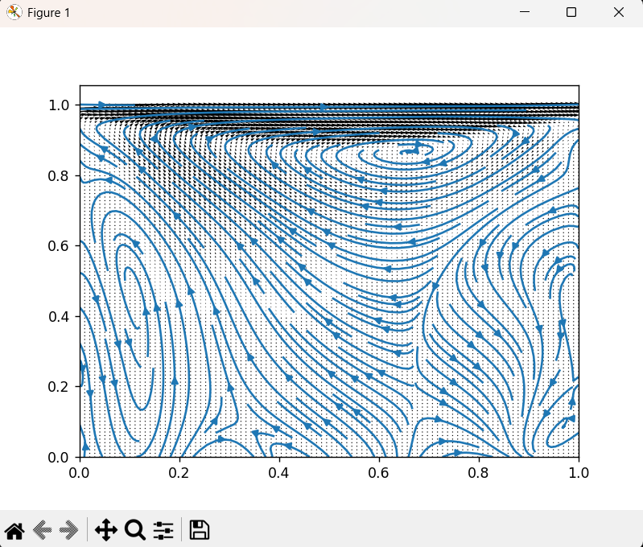
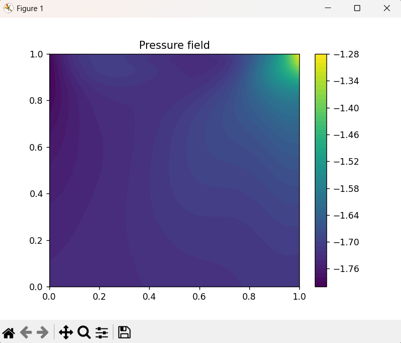

# Physics Informed Neural Network (PINN) for 2D Lid Driven Cavity Flow

## Project Overview

This project implements a **Physics Informed Neural Network (PINN)** to solve the 2D incompressible Navier–Stokes equations for the classical lid-driven cavity flow problem.

Instead of relying on traditional CFD discretization methods (FEM/FVM/FDM), the neural network learns the solution by minimizing the governing physics equations directly.

The model predicts:

• u velocity component  
• v velocity component  
• Pressure field  

---

## Governing Equations

### Continuity equation

∂u/∂x + ∂v/∂y = 0

### Momentum equations

u∂u/∂x + v∂u/∂y = −∂p/∂x + (1/Re)(∂²u/∂x² + ∂²u/∂y²)

u∂v/∂x + v∂v/∂y = −∂p/∂y + (1/Re)(∂²v/∂x² + ∂²v/∂y²)

Reynolds number used:

Re = 100

---

## Boundary Conditions

Top wall (moving lid):

u = 1  
v = 0  

Other walls:

u = 0  
v = 0  

---

## Neural Network Architecture

Input layer:
(x,y)

Hidden layers:
3 hidden layers with 50 neurons each

Activation function:
Tanh

Output layer:
(u,v,p)

---

## Training Details

Physics collocation points:
10000

Boundary points:
2000 per boundary

Optimizer:
Adam

Learning rate:
0.001

Training epochs:
5000

Loss function:

Loss = Physics Loss + Boundary Loss

Physics loss enforces:

• Continuity equation  
• X-momentum equation  
• Y-momentum equation  

---

## Results

### Velocity Field (Streamlines + Vector field)

The velocity field shows the expected primary vortex structure typical of lid-driven cavity flow at Re = 100.

---

### Pressure Field

The pressure contour shows the pressure gradient induced by the moving lid and internal circulation.

---

## How to Run

Install dependencies:
pip install -r requirements.txt

Run simulation:
python cavity_flow.py

---

## Future Improvements

Possible extensions of this work:

• Higher Reynolds number simulations  
• Loss convergence plots  
• Vorticity visualization  
• L-BFGS optimizer refinement  
• Comparison with benchmark CFD data  
• Transient Navier–Stokes extension  
• 3D cavity flow  

---

## Author

Manya Johari  

Aerospace Engineering Student  

Interests:
Physics Informed Neural Networks  
Computational Fluid Dynamics  
Computational Physics  
Scientific Machine Learning
